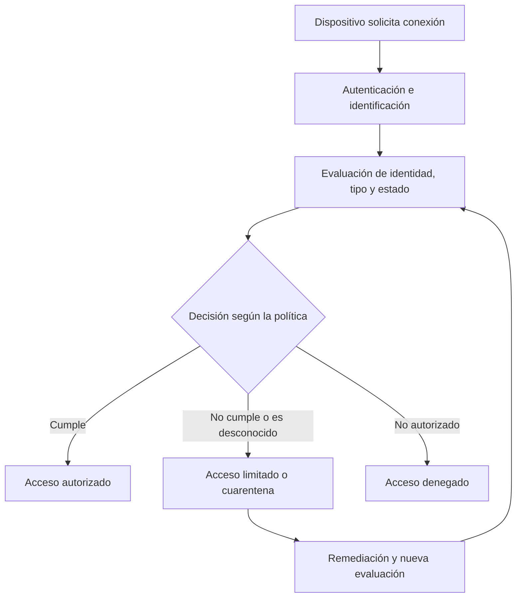

# NAC (Network Access Control - Control de Acceso a la Red)

  

    Categoría
    Arquitectura y Seguridad en Redes
  

  

    Tecnologías habituales
    IEEE 802.1X | RADIUS | EAP
  

  

    Autor
    <a href="https://github.com/cibercelia" target="_blank">@cibercelia</a>
  

## 📖 Definición

**NAC (Network Access Control)**, o **Control de Acceso a la Red**, es el conjunto de políticas y mecanismos que determina qué dispositivos pueden conectarse a una red y a qué recursos pueden acceder. Para tomar esa decisión puede comprobar la identidad del usuario y del dispositivo, el tipo de conexión y el estado de seguridad del equipo, como si está actualizado o cumple las políticas de la organización.

Según el resultado, NAC puede permitir el acceso, limitarlo a determinados recursos, trasladar el dispositivo a una red de cuarentena o denegar la conexión. Las decisiones pueden aplicarse al conectarse y reevaluarse posteriormente, si la solución y la política lo permiten.

!!! warning "Importante"
    NAC no es por sí solo un antivirus ni garantiza que un dispositivo esté libre de amenazas. Es un mecanismo de control y aplicación de políticas de red; debe complementarse con controles de identidad, protección de endpoints, segmentación y monitorización.

---

## 🔄 ¿Cómo funciona?

1. **Identificación**: se determina quién o qué intenta conectarse, por ejemplo, un usuario corporativo, un dispositivo gestionado o un invitado.
2. **Evaluación**: se contrastan la identidad, el tipo de dispositivo y las señales de cumplimiento disponibles con la política de acceso.
3. **Decisión**: se autoriza, restringe, pone en cuarentena o deniega la conexión.
4. **Aplicación**: la infraestructura de red aplica la decisión mediante mecanismos como VLAN, ACL o políticas del punto de acceso.
5. **Reevaluación**: cuando está configurada, la solución vuelve a valorar el acceso ante cambios relevantes en el estado o el contexto del dispositivo.

---

## 🧩 Componentes y tecnologías habituales

- **Solicitante (*supplicant*)**: software o función del dispositivo que participa en la autenticación de red, por ejemplo, mediante 802.1X.
- **Punto de aplicación**: switch, punto de acceso inalámbrico o gateway que controla la conexión y aplica la decisión.
- **Servidor de autenticación y políticas**: valida credenciales y determina el resultado, a menudo mediante **RADIUS**.
- **IEEE 802.1X y EAP**: estándares y protocolos que permiten autenticar dispositivos en redes cableadas e inalámbricas. 802.1X no es un producto NAC completo; es una de las tecnologías que puede utilizarse para controlar el acceso.
- **Evaluación de postura**: comprobación de señales de seguridad o cumplimiento del dispositivo. La profundidad de estas comprobaciones depende de la solución y de la integración con herramientas de gestión de endpoints.
- **Mecanismos de aplicación**: asignación de VLAN, listas de control de acceso (ACL), políticas dinámicas o redes de cuarentena.

---

## 🔍 Modos de acceso frecuentes

| Modo | Uso habitual | Consideraciones |
| :--- | :--- | :--- |
| **802.1X** | Autenticación de usuarios o dispositivos en puertos cableados y redes Wi-Fi compatibles. | Puede ofrecer autenticación basada en credenciales o certificados; requiere configuración coherente en clientes e infraestructura. |
| **Invitados** | Conceder acceso temporal a visitantes. | Conviene aislarlo de los recursos internos y limitar su duración y permisos. |
| **Dispositivos sin 802.1X** | Conectar impresoras, teléfonos u otros equipos que no admiten el método requerido. | Métodos como la autenticación basada en MAC (MAB) son menos sólidos: una dirección MAC puede falsificarse y no demuestra por sí sola la identidad del dispositivo. |
| **Cuarentena o remediación** | Restringir equipos desconocidos o que no cumplen la política. | El acceso debe limitarse a los servicios necesarios para registrar o corregir el dispositivo. |

---

## 🆚 NAC y 802.1X: no son lo mismo

**NAC** describe el enfoque de control de acceso y las políticas que deciden qué conectividad conceder. **802.1X** es un estándar de control de acceso a la red basado en puertos que puede formar parte de una implementación NAC. Una solución NAC puede combinar 802.1X con RADIUS, evaluación de postura, segmentación, gestión de invitados y otros mecanismos.

---

## 🛡️ Buenas prácticas

1. **Usar autenticación robusta**: cuando sea viable, preferir certificados u otros métodos resistentes a la suplantación frente a identificadores fácilmente falsificables.
2. **Aplicar mínimo privilegio**: asignar a cada usuario y dispositivo solo el acceso que necesita, segmentando redes y recursos.
3. **Aislar los dispositivos no gestionados**: establecer políticas específicas para invitados y equipos que no puedan evaluarse completamente.
4. **Definir una respuesta de cuarentena segura**: permitir únicamente los servicios indispensables para la inscripción o remediación.
5. **Proteger la infraestructura de autenticación**: restringir y monitorizar la comunicación con los servidores RADIUS y administrar de forma segura los puntos de aplicación.
6. **Probar antes de imponer**: desplegar las políticas gradualmente y probar equipos heredados, dispositivos médicos o industriales y escenarios de recuperación para evitar interrupciones.
7. **Supervisar excepciones y registros**: revisar las denegaciones, los dispositivos desconocidos y las excepciones para detectar configuraciones obsoletas o accesos anómalos.

---

## 🔗 Relación con Zero Trust

NAC puede contribuir a una arquitectura **Zero Trust** al ayudar a verificar el dispositivo y limitar su acceso a la red. Sin embargo, conceder acceso a una red —incluso después de una comprobación NAC— no sustituye la autorización específica para cada aplicación o recurso ni la evaluación continua de identidad y contexto.

---

## 🔗 Referencias

- [RFC 3580: IEEE 802.1X Remote Authentication Dial In User Service (RADIUS) Usage Guidelines](https://www.rfc-editor.org/rfc/rfc3580)
- [Microsoft Learn: Network Policy Server (NPS)](https://learn.microsoft.com/en-us/windows-server/networking/technologies/nps/nps-top)
- [NIST Special Publication 800-207: Zero Trust Architecture](https://csrc.nist.gov/publications/detail/sp/800-207/final)
